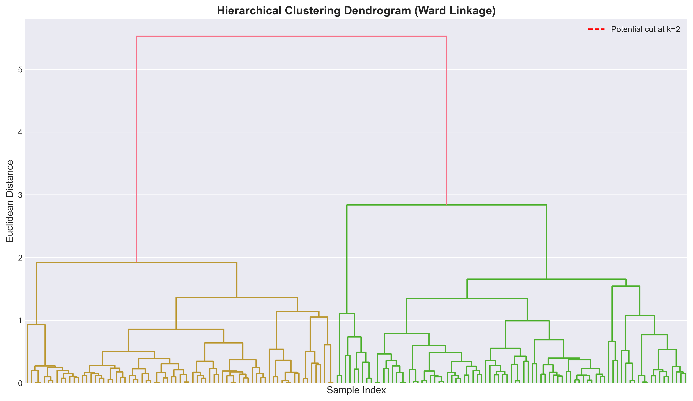
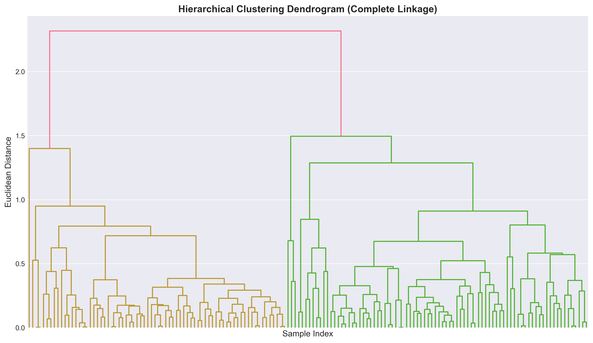
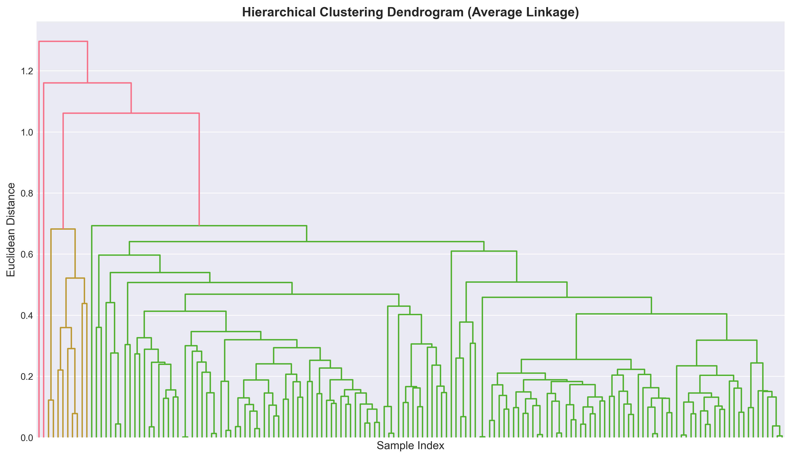
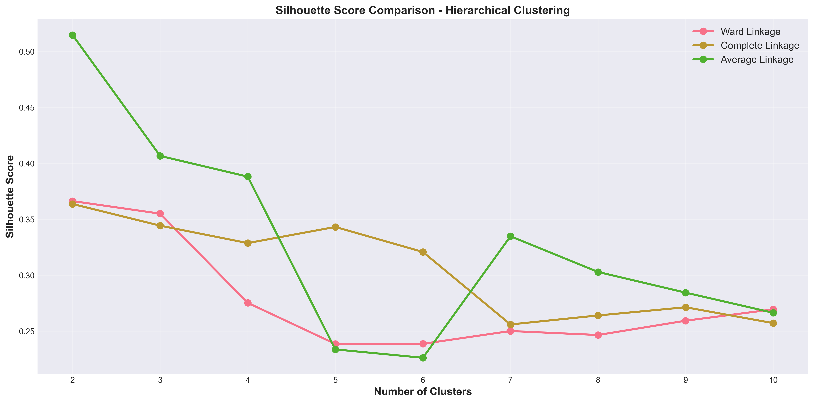
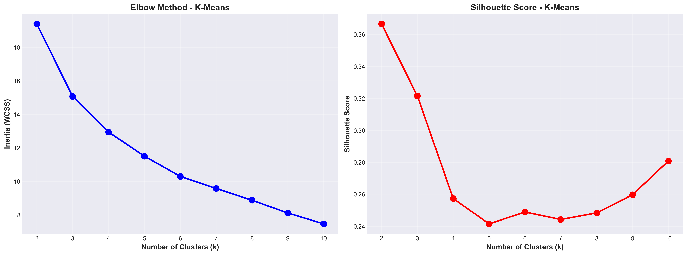
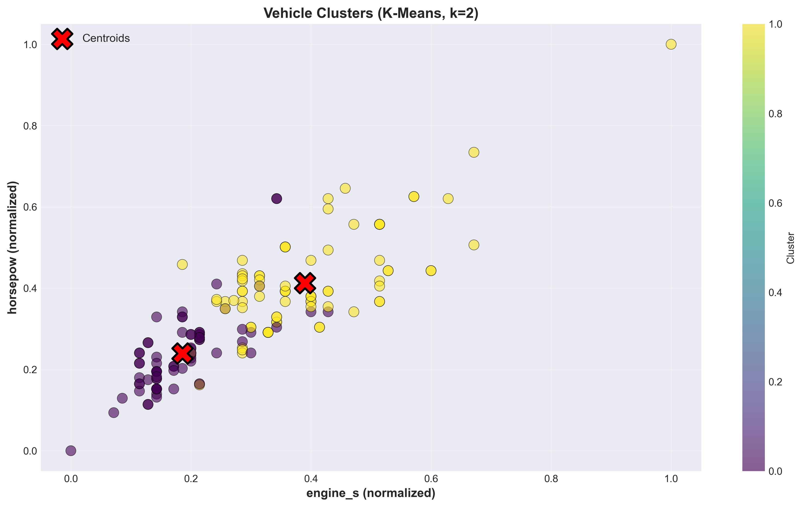

# 🚗 Vehicle Market Segmentation – Clustering Analysis

**Quick Snapshot**
- Dataset: Vehicle specifications (156 records, 8 numerical features)
- Task: Market segmentation (unsupervised learning / clustering)
- Techniques compared: Hierarchical Clustering, K-Means
- Best clustering: Hierarchical Clustering (Ward / Average Linkage)
- Key insight: Vehicles naturally group by engine size, horsepower, weight, and dimensions


## 📌 Project Overview

This project applies **unsupervised machine learning clustering techniques** to segment vehicles based on technical specifications.

**Note:** The dataset was provided as a **Data Science Bootcamp task** and does **not** represent any real vehicle market data. This is purely an **educational exercise**.

**Objective:**
- Discover **natural vehicle clusters**
- Compare **Hierarchical Clustering** vs **K-Means**
- Determine **optimal number of clusters**
- Translate clustering results into **business insights**

---

## 🎯 Background

1. Segment vehicles using technical specs: engine, horsepower, weight, size, fuel efficiency
2. Compare multiple clustering algorithms using **silhouette score and cluster interpretability**
3. Identify which approach produces the most meaningful and balanced clusters
4. Support hypothetical business decisions, like product positioning or prototype comparison

---

## 🗂️ Dataset Overview

**Source:** Provided by Data Science Bootcamp (156 records)

**Features Used for Clustering:**

| Feature  | Description             |
| -------- | ----------------------- |
| engine_s | Engine size (liters)    |
| horsepow | Horsepower              |
| wheelbas | Wheelbase (inches)      |
| width    | Vehicle width (inches)  |
| length   | Vehicle length (inches) |
| curb_wgt | Curb weight (1,000 lbs) |
| fuel_cap | Fuel capacity (gallons) |
| mpg      | Miles per gallon        |


**Problem Type:** Unsupervised learning - Clustering

> **⚠️ Disclaimer**
Dataset is synthetic/educational; any real-world conclusions should not be drawn from this data.

---

## 🛠️ Tools I Used

**Programming & Libraries:**

* **Python** – Analysis and model implementation
* **NumPy** – Numerical computations and array operations
* **Pandas** – Data manipulation and analysis
* **Matplotlib / Seaborn / SciPy** – Data visualization and dendrograms
* **Scikit-learn** – Machine learning models, preprocessing, metrics and model evaluation

**Development Environment:**

* **Jupyter Notebook** – Interactive development and analysis
* **Google Colab** – Optional cloud-based notebook environment

---

## 🚀 Getting Started

### Prerequisites

* Python 3.11 or higher
* Jupyter Notebook or Google Colab
* Conda (recommended) or pip

### Installation

1. **Clone the repository**

   ```bash
    git clone https://github.com/NadiaRozman/ML_Clustering_Vehicle_Segmentation.git
    cd ML_Clustering_Vehicle_Segmentation
   ```

2. **Install dependencies**

   **Option 1: Using Conda**

   ```bash
   conda env create -f environment.yml
   conda activate ml_vehicle_clustering
   ```

   **Option 2: Using pip**

   ```bash
   pip install -r requirements.txt
   ```

3. **Launch Jupyter Notebook**

   ```bash
   jupyter notebook
   ```

4. **Open and run the notebook**

   * Navigate to `notebook/Vehicle_Market_Segmentation_Clustering.ipynb`
   * Ensure `vehicle_specifications.csv` is in the correct directory
   * Run all cells to reproduce the analysis

---

## 🔬 Clustering Models Implemented

### **1. Hierarchical Clustering**
- Linkage methods compared: **Ward, Complete, Average**
- Evaluated **optimal number of clusters** using dendrograms and silhouette scores

**Ward Linkage Dendrogram**  
  
*Figure 1: Hierarchical clustering using Ward linkage minimizes within-cluster variance.*

**Complete Linkage Dendrogram**  
  
*Figure 2: Hierarchical clustering using Complete linkage minimizes the maximum distance between clusters.*

**Average Linkage Dendrogram**  
  
*Figure 3: Hierarchical clustering using Average linkage minimizes the average distance between all pairs.*

**Hierarchical Clustering Silhouette Scores**  
  
*Figure 4: Silhouette scores for hierarchical clustering methods; helps identify optimal number of clusters.*

### **2. K-Means Clustering**

- Tested clusters from k=2 to k=10
- Optimal k selected based on **silhouette score** and **inertia (WCSS)**

**Elbow Method & Silhouette Scores**  
  
*Figure 5: Elbow method and silhouette scores for K-Means; optimal k = 2.*

**Final K-Means Cluster Visualization**  
  
*Figure 6: K-Means clustering scatter plot showing 2 vehicle clusters based on features.*

---

## Cluster Analysis

**Sample Vehicles by Cluster (K-Means, k=2)**

| Cluster | Sample Models                    | Avg Engine | Avg HP | Avg MPG | Avg Weight |
| ------- | -------------------------------- | ---------- | ------ | ------- | ---------- |
| 0       | Acura Integra, Audi A4, BMW 323i | 2.3 L      | 150    | 26.5    | 2.88k lbs  |
| 1       | Acura TL, Audi A6, Buick Regal   | 3.7 L      | 218    | 21.5    | 3.82k lbs  |

> Clusters differentiate vehicles roughly by engine size, horsepower, weight, and dimensions.

---

## Hierarchical vs K-Means

| Metric           | Hierarchical (Average) | K-Means |
| ---------------- | ---------------------- | ------- |
| Clusters         | 2                      | 2       |
| Silhouette Score | 0.5147                 | 0.3666  |


**🏆 Winner:** Hierarchical Clustering (Average Linkage) – higher silhouette score, though K-Means produced more balanced clusters.

---
## 🔍 Insights & Business Implications

- Vehicles naturally segment into **low-power / compact** vs **high-power / large groups**
- Hierarchical Clustering captures outliers more clearly
- K-Means provides balanced clusters suitable for **portfolio comparison**
- Hypothetical application: guiding **prototype design** or **market positioning**

---

## 📚 What I Learned

- Applied multiple clustering algorithms and compared results
- Learned **feature scaling** importance for distance-based methods
- Visualized hierarchical relationships with dendrograms
- Interpreted clusters with **silhouette score** and sample data
- Translated unsupervised learning outputs into actionable insights 

---

## 🔮 Future Enhancements

- Explore **dimensionality reduction (PCA, t-SNE)** for better visualization
- Hyperparameter tuning for K-Means initialization
- Include more features or categorical variables
- Deployment: dashboard visualization (Streamlit / Plotly)
- Cross-validation for unsupervised clustering stability

---

### ✨ Created by Nadia Rozman | January 2026

📂 **Project Structure**
```
ML_Clustering_Vehicle_Segmentation/
│
├── data/
│   └── vehicle_specifications.csv
│
├── images/
│   ├── 1_dendrogram_ward.png
│   ├── 2_dendrogram_complete.png
│   ├── 3_dendrogram_average.png
|   ├── 4_hierarchical_silhouette.png
│   ├── 5_kmeans_elbow_silhouette.png
│   └── 6_kmeans_scatter.png
│
├── notebooks/
│   └── Vehicle_Market_Segmentation_Clustering.ipynb
│
├── requirements.txt
├── environment.yml
└── README.md
```

**🔗 Connect with me**
- GitHub: [@NadiaRozman](https://github.com/NadiaRozman)
- LinkedIn: [Nadia Rozman](https://www.linkedin.com/in/nadia-rozman-4b4887179/)

**⭐ If you found this project helpful, please consider giving it a star!**
